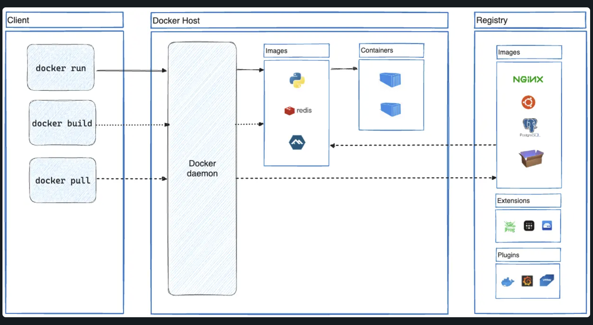
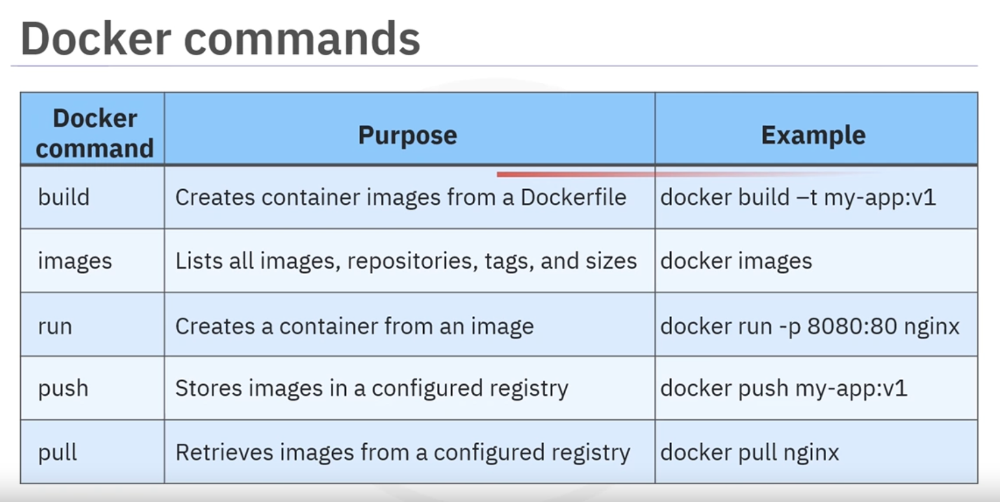

# Containers
## Table of Content
[1. Introduction](#1-introduction)
[2. Basic Concept](#2-basic-concept)


## 1. Introduction
- Docker is an open platform for developing, shipping, and running applications.
- Separate applications from infrastructure for quick delivery <br>
    &rarr; package and run an application in a loosely isolated environment called container.<br>
    &rarr; container size and spec are standardized, which make them flexible and portable.<br>
- Docker uses a client-server architecture that communicate with eah other through REST API
    &rarr; Docker client is the command line tool that interacts with the Docker daemon.<br>
    &rarr; Docker daemon is the background service that manages containers.<br>



- Docker command:


- Step to create and run container:
    1. Create Dockerfile 
    2. Build image
    3. Use an image to create running container

## 2. Basic COncept
### Container
-  Containers are isolated processes for each of the application's components &rarr; running instances of docker's image
-  Each component - the frontend React app, the Python API engine, and the database = each container
-  Each container has its own file system, network stack, and process space.
- Containers are:
    - **Self-contained**: Each container has everything it needs to function <br>
        &rarr; no reliance on any pre-installed dependencies on the host machine.
    - **Isolated**: Since containers are run in isolation <br>
        &rarr; minimal influence on the host and other containers<br>
        &rarr; increasing the security of your applications.<br>
    - **Independent**: Each container is independently managed <br>
        &rarr; Deleting one container won't affect any others. <br>
    - **Portable**: Containers can run anywhere! <br>
        &rarr; The container that runs on your development machine will work the same way in a data center or anywhere in the cloud!<br>
- Container work on many types of OS and platforms while VM is 
### Images
-  A container image is a standardized package that includes all of the files, binaries, libraries, and configurations to run a container.
- There are two important principles of images:
    - Images are **immutable**. <br>
        &rarr; Once an image is created, it can't be modified. You can only make a new image or add changes on top of it.
    - **Container images are composed of layers**. <br>
        &rarr; Each layer = a set of file system changes that add, remove, or modify files.
### Registry
- Docker registries stores Docker images
    &rarr; Docker Hub is the official Docker registry. <br>
    &rarr; Amazon Elastic Container Registry (Amazon ECR)
    &rarr; Azure Container Registry <br>
    &rarr; Google Container Registry<br>
### Dockerfile
- Dockerfile is a text file that contains instructions for building a Docker image.
- Create a Docker image from a base image.
- Dockerfile is used to install dependencies, copy files, and set environment variables.
- Workflow in Dockerfile:
    1. Determine your base image
    2. Install application dependencies
    3. Copy in any relevant source code and/or binaries
    4. Configure the final image

#### Django
```dockerfile
# Step 1: specifies the base image that the build will extend
# Use an official Python runtime as a parent image and slim as base image type
FROM python:3.11-slim

# Step 2: Set the working directory in the container
# Path in the image where files will be copied and commands will be executed.
WORKDIR /usr/src/app

# Step 3: Copy the current directory contents into the container at /usr/src
# COPY <host-path> <image-path>
COPY src ./src


# Step 4: Install any needed packages specified in requirements.txt
RUN pip install --no-cache-dir -r requirements.txt

# Step 5: Make port 8000 available to the world outside this container
EXPOSE 8000

# Step 6: Define environment variable
ENV DJANGO_ENV=production

# Step 7: Run the application
RUN pip install gunicorn
CMD ["gunicorn", "--bind", "0.0.0.0:8000", "myproject.wsgi:application"]
```

#### Angular
```dockerfile
# Use an official Node.js image as a base image
FROM node:14 AS build


# Set the working directory
WORKDIR /app

# Copy package.json and package-lock.json (if available) into the working directory
COPY package*.json ./

# Install the dependencies
RUN npm install

# Copy the rest of the application source code
COPY . .

# Build the Angular application
RUN npm run build --prod

# Step 2: Serve Stage
# Use an official Nginx stable image to serve the application
FROM nginx:stable-alpine

# Copy the built Angular app from the build stage into the Nginx serving directory
COPY --from=build /app/dist/your-angular-app /usr/share/nginx/html

# Copy custom Nginx configuration, if applicable (optional)
# COPY nginx.conf /etc/nginx/nginx.conf

# Expose the default Nginx port
EXPOSE 80

# Start Nginx
CMD ["nginx", "-g", "daemon off;"]
```

#### Postgres
```dockerfile
# Use the official PostgreSQL image as the base image
FROM postgres:14

# Set environment variables
# These default values can be overridden by docker run --env
ENV POSTGRES_USER=myuser
ENV POSTGRES_PASSWORD=mypassword
ENV POSTGRES_DB=mydatabase

# Optionally copy a custom PostgreSQL configuration file 
# COPY custom-postgresql.conf /etc/postgresql/postgresql.conf

# Optionally copy SQL scripts to be executed in the init phase
# COPY init.sql /docker-entrypoint-initdb.d/

# Expose PostgreSQL port
EXPOSE 5432

# The default command for the postgres image is already set to run the server,
# but we can override it here if needed.
```